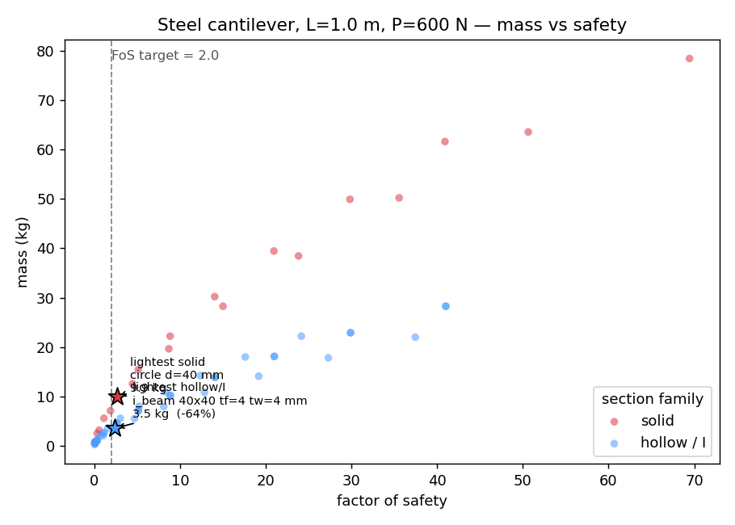
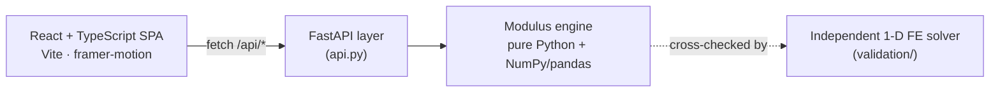

# Modulus

**A structural design optimization engine that sizes beams and brackets.** Give it a
load case and a target factor of safety; it sweeps every material × cross-section ×
dimension, checks each candidate against bending, deflection, and buckling, and returns
the best design — lightest, cheapest, highest safety margin, or best-balanced — with the
weight/cost/strength tradeoffs plotted. The analytical model is validated against an
independent finite-element solver, and the whole thing ships as a React web app over a
Python engine.

[](https://github.com/Aaditya-Gupta24/Modulus/actions/workflows/ci.yml)


🔗 **Live demo** — not yet deployed; spin one up in ~5 min with **[DEPLOY.md](DEPLOY.md)**, then drop the URL here
&nbsp;·&nbsp; 📐 **[Case study](backend/docs/CASE_STUDY.md)**
&nbsp;·&nbsp; 🧪 **[Validation report](backend/validation/VALIDATION.md)**
&nbsp;·&nbsp; 📄 **[Engineering spec](backend/SPEC.md)**

---

## What it does

- **Sweeps the design space.** 6 engineering materials × 6 cross-sections × a range of
  dimensions — thousands of candidates evaluated per run.
- **Checks real failure modes.** Bending stress, deflection limits, and Euler column
  buckling, each as an explicit pass/fail with its safety margin.
- **Recommends, with reasons.** Picks the lightest / cheapest / safest / best-balanced
  safe design and explains why it won.
- **Finds the Pareto front.** Surfaces the designs where you can't get lighter without
  paying more (or losing margin), plus the knee point.
- **Quantifies uncertainty.** Monte-Carlo simulation over material and load scatter gives
  a reliability estimate, not just a single deterministic number.
- **Snaps to reality.** Matches the optimum to standard buyable stock sizes and bolt
  diameters.
- **Exports.** CSV / JSON / PDF design reports straight from the API.

## Screenshots

<!--
  Two real figures below render out of the box. To add live app screenshots,
  run the app (see "Run it locally") and follow docs/media/README.md.
-->

|                                                        |                                                    |
| ------------------------------------------------------ | -------------------------------------------------- |
|  |  |
| Analytical deflections vs. an independent FE solver    | Weight–cost Pareto front for a beam sweep          |

> _App screenshots (Dashboard, Beam Optimizer, Bracket Analysis) go in `docs/media/` —
> see [`docs/media/README.md`](docs/media/README.md) for the exact shots and how to
> capture them._

## Architecture

One Python engine, wrapped by a thin FastAPI layer, driven by a React SPA. In production
a single container serves both the API and the built frontend from the same origin.



The engine is deliberately UI-agnostic: `api.py` only marshals JSON, and every number the
app shows is produced by a plain, testable Python function.

| Layer        | Modules                                                                                     |
| ------------ | ------------------------------------------------------------------------------------------- |
| **Mechanics**| `materials`, `sections`, `beam`, `buckling`, `bracket`                                       |
| **Decision** | `optimizer` (sweep), `decision` (rank / Pareto / knee), `failure_modes`, `design_review`    |
| **Rigor**    | `uncertainty` (Monte-Carlo), `envelope` (load cases), `stock` (buyable sizes), `units`      |
| **Output**   | `report` (CSV/JSON/PDF), `visuals` (SVG diagrams), `validation/` (independent FE solver)     |

## Engineering basis

Everything is closed-form linear-elastic beam theory — no black boxes.

| Quantity              | Equation                                             |
| --------------------- | ---------------------------------------------------- |
| Rectangle / circle I  | `b·h³/12`  ·  `π·d⁴/64`                               |
| I-beam I              | `(b·h³ − (b−t_w)(h−2t_f)³) / 12`                      |
| Tube I (square/round) | `(a⁴ − a_i⁴)/12`  ·  `π(d⁴ − d_i⁴)/64`               |
| Bending stress        | `σ = M·c / I`                                         |
| Cantilever, end load  | `M = P·L`,  `δ = P·L³ / (3·E·I)`                      |
| Simply sup., centre   | `M = P·L/4`,  `δ = P·L³ / (48·E·I)`                  |
| Factor of safety      | `FoS = σ_yield / σ`                                  |
| Euler buckling        | `P_cr = π²·E·I / (K·L)²`,  `λ = K·L / r`             |
| Weight / cost         | `A·L·ρ`  ·  `weight × cost-per-kg`                    |

A worked example is pinned as a known-answer test: steel A36, solid 30×30 mm, L = 0.8 m,
P = 300 N cantilever → I = 6.75×10⁻⁸ m⁴, σ ≈ 53.3 MPa, δ ≈ 3.79 mm, FoS ≈ 4.69.

## Validation — why the numbers are trustworthy

Passing tests only prove the code matches *my* equations. To check the equations
themselves, Modulus is validated two independent ways
([full report](backend/validation/VALIDATION.md)):

- **Against an independent FE solver.** `validation/fea_beam.py` is a from-scratch 1-D
  finite-element beam solver (direct stiffness, Hermite cubic elements) that shares no code
  with the analytical model. Analytical deflections and moments match it to **< 0.01 %**
  across solid, tube, and I-sections.
- **Against a higher-fidelity theory.** Comparing Euler–Bernoulli to shear-corrected
  Timoshenko theory bounds the modelling error: **< 0.4 % for slender beams (L/h ≳ 15)**,
  a known limit the app surfaces in its Assumptions view.

## Run it locally

Two terminals. The engine uses [`uv`](https://docs.astral.sh/uv/); the frontend uses npm.

**API + engine**

```bash
cd backend
uv run --extra api python api.py        # http://localhost:8000
```

**Frontend** (separate terminal)

```bash
cd frontend
npm install
npm run dev                             # http://localhost:5173  (proxies /api → :8000)
```

**Production-style single service** (one server serves SPA + API):

```bash
cd frontend && npm run build
cd ../backend && uv run --extra api uvicorn api:app --port 8000   # http://localhost:8000
```

No `uv`? Use pip: `cd backend && pip install -e ".[api]" && python api.py`.

## Tests

```bash
cd backend
uv run --extra dev pytest -q            # 354 passing
```

Tests are the correctness oracle: every numeric target is **hand-derived from the governing
equation**, never reverse-engineered to match the code. GitHub Actions runs the full Python
suite and a frontend type-check + build on every push.

## Project layout

```
.
├── frontend/            React + TypeScript SPA (Vite)
│   └── src/views/       Dashboard, Beam Optimizer, Bracket Analysis, Compare, Validation…
├── backend/             Python project root
│   ├── modulus/         core engine (mechanics, optimizer, decision, uncertainty, report…)
│   ├── validation/      independent FE solver + validation report
│   ├── tests/           354 hand-derived known-answer + behavioural tests
│   ├── docs/            engineering case studies
│   ├── api.py           FastAPI layer (also serves the built SPA in production)
│   └── SPEC.md          build contract / engineering spec
├── Dockerfile           multi-stage: build SPA → serve SPA + API from one container
├── render.yaml          one-click Render Blueprint
└── DEPLOY.md            deploy walkthrough (Render / Fly / Railway)
```

## Assumptions & limitations

Linear-elastic material, small-deflection (Euler–Bernoulli) theory, static point loads,
prismatic members, strong-axis bending. Material and cost figures are nominal grade values,
not vendor datasheets. Not modelled: local/wall buckling, stress concentrations, fatigue,
dynamic loading, weld/joint effects. **Modulus is a first-pass screening tool, not a
substitute for detailed analysis or sign-off by a licensed engineer.**

## License

MIT © 2026 Aaditya Gupta
