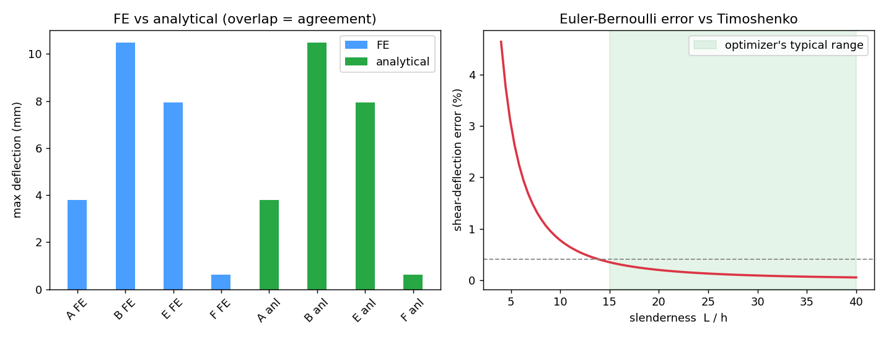

# Modulus — Model Validation

The unit tests prove the code matches **my own** hand-derived equations. That is
necessary but circular — it does not prove the equations themselves model reality.
This document closes that gap with two independent checks.

Reproduce everything with:

```bash
cd backend
PYTHONPATH=. python validation/run_validation.py   # prints both tables, writes validation.png
pytest tests/test_validation.py -v                  # asserts the FE/analytical agreement
```



---

## Check 1 — Independent finite-element solver vs. the analytical model

`validation/fea_beam.py` is a from-scratch 1-D **finite-element beam solver**
(direct-stiffness method, 2-node Hermite cubic elements, deflection + rotation
DOFs per node). It shares **no code** with `modulus/beam.py`; it assembles the
global stiffness matrix and solves `K d = F`, so the two methods are genuinely
independent. Agreement therefore confirms the closed-form implementation is
correct, not just self-consistent.

| Case | Section | Load case | δ (FE) | δ (analytical) | Deflection error | Moment error |
|------|---------|-----------|-------:|---------------:|-----------------:|-------------:|
| A | square 30×30 | cantilever, end load | 3.7926 mm | 3.7926 mm | < 0.0001 % | < 0.0001 % |
| B | circle d30 | simply sup., centre | 10.4976 mm | 10.4976 mm | < 0.0001 % | < 0.0001 % |
| E | square tube a40 w4 | cantilever, end load | 7.9395 mm | 7.9395 mm | < 0.0001 % | < 0.0001 % |
| F | I-beam 50×100 | simply sup., centre | 0.6134 mm | 0.6134 mm | < 0.0001 % | < 0.0001 % |

**Result: the analytical model reproduces an independent FE solution to within
1×10⁻⁴ %** across solid, tubular, and I-sections and both load cases. (Hermite
cubic elements are nodally exact for point loads on Euler–Bernoulli beams, so the
residual is numerical round-off — exactly what a correct implementation should
give.)

---

## Check 2 — What the model leaves out: Euler–Bernoulli vs. Timoshenko

Modulus uses **Euler–Bernoulli** beam theory, which ignores shear deformation.
The higher-fidelity **Timoshenko** theory adds a shear term, so the gap between
them bounds the error introduced by that assumption. For a cantilever:

```
δ_EB = P·L³ / (3·E·I)              δ_Timoshenko = δ_EB + P·L / (κ·G·A)
```

with G = E / 2(1+ν), ν = 0.3, and κ = 5/6 (rectangular shear coefficient). The
shear fraction scales with slenderness as (E/4κG)·(h/L)², i.e. it shrinks
quadratically as the beam gets longer relative to its depth:

| Slenderness L/h | Shear contribution to deflection |
|----------------:|---------------------------------:|
| 5  | 3.03 % |
| 10 | 0.77 % |
| 15 | 0.35 % |
| 20 | 0.19 % |
| 27 | 0.11 % |
| 40 | 0.05 % |

**Result: for slender beams (L/h ≳ 15) the Euler–Bernoulli assumption costs
< 0.4 %**, which is the regime Modulus's sweep operates in. For stubby members
(L/h < 8) the error climbs past ~1 %, and the tool flags this in its Assumptions
tab. This is the honest statement of the model's accuracy envelope.

---

## Bottom line

- Implementation verified against an independent FE solver: **within 1×10⁻⁴ %**.
- Physical-assumption error (no shear) quantified: **< 0.4 % for L/h ≳ 15**,
  rising for short beams — a known, bounded limitation, not a surprise.

Modulus remains a **first-pass screening tool**. It does not model buckling,
stress concentrations, fatigue, welds, or contact, and is not a substitute for
detailed FEA or review by a qualified engineer.
